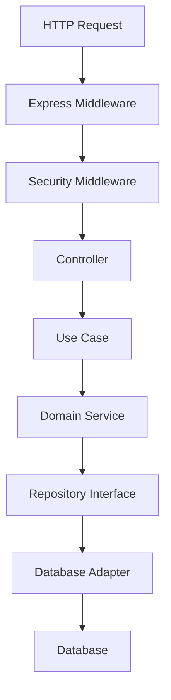

# Design Document - Spotify API Security

## Overview

Esta API implementa una arquitectura hexagonal (Ports & Adapters) con Express.js, enfocándose en las mejores prácticas de seguridad informática. El diseño prioriza la separación de responsabilidades, seguridad de autenticación JWT, y protección contra vulnerabilidades de la cadena de suministro NPM.

### Principios de Diseño

- **Arquitectura Hexagonal**: Separación clara entre dominio, aplicación e infraestructura
- **Security by Design**: Implementación de medidas de seguridad desde el diseño
- **Dependency Security**: Gestión segura de dependencias NPM
- **OWASP Compliance**: Protección contra las vulnerabilidades más comunes

## Architecture

### Estructura de Capas

```
src/
├── domain/                 # Capa de Dominio (Entidades y Reglas de Negocio)
│   ├── entities/
│   ├── repositories/       # Interfaces de repositorios
│   └── services/          # Servicios de dominio
├── application/           # Capa de Aplicación (Casos de Uso)
│   ├── use-cases/
│   ├── ports/            # Puertos (interfaces)
│   └── dto/              # Data Transfer Objects
├── infrastructure/       # Capa de Infraestructura (Adaptadores)
│   ├── web/              # Controladores Express
│   ├── persistence/      # Implementación de repositorios
│   ├── security/         # JWT, hashing, validación
│   └── config/           # Configuración
└── shared/               # Utilidades compartidas
    ├── errors/
    ├── validators/
    └── middleware/
```

### Flujo de Datos



## Components and Interfaces

### 1. Domain Layer

#### Entities
```typescript
// User Entity
interface User {
  id: UserId
  email: Email
  username: Username
  password: HashedPassword
  role: UserRole
  profile: UserProfile
  createdAt: Date
  updatedAt: Date
}

// Artist Entity
interface Artist {
  id: ArtistId
  userId: UserId
  artistName: string
  biography: string
  genres: Genre[]
  albums: Album[]
}

// Song Entity
interface Song {
  id: SongId
  title: string
  duration: number
  artistId: ArtistId
  albumId?: AlbumId
  filePath: string
  metadata: SongMetadata
}
```

#### Repository Interfaces
```typescript
interface UserRepository {
  save(user: User): Promise<User>
  findById(id: UserId): Promise<User | null>
  findByEmail(email: Email): Promise<User | null>
  findByUsername(username: Username): Promise<User | null>
}

interface SongRepository {
  save(song: Song): Promise<Song>
  findById(id: SongId): Promise<Song | null>
  findByArtist(artistId: ArtistId): Promise<Song[]>
  findPublic(filters: SongFilters): Promise<PaginatedResult<Song>>
}
```

### 2. Application Layer

#### Use Cases
```typescript
// Authentication Use Cases
class RegisterUserUseCase {
  constructor(
    private userRepo: UserRepository,
    private passwordHasher: PasswordHasher,
    private validator: UserValidator
  ) {}
  
  async execute(command: RegisterUserCommand): Promise<UserDto> {
    // Validación, hashing, persistencia
  }
}

class LoginUseCase {
  constructor(
    private userRepo: UserRepository,
    private passwordHasher: PasswordHasher,
    private jwtService: JwtService
  ) {}
  
  async execute(command: LoginCommand): Promise<AuthTokenDto> {
    // Autenticación y generación de JWT
  }
}
```

#### Ports (Interfaces)
```typescript
interface PasswordHasher {
  hash(password: string): Promise<string>
  verify(password: string, hash: string): Promise<boolean>
}

interface JwtService {
  generateToken(payload: JwtPayload): string
  verifyToken(token: string): JwtPayload | null
  refreshToken(token: string): string | null
}
```

### 3. Infrastructure Layer

#### Web Controllers
```typescript
@Controller('/api/auth')
class AuthController {
  constructor(
    private registerUseCase: RegisterUserUseCase,
    private loginUseCase: LoginUseCase
  ) {}
  
  @Post('/register')
  @ValidateBody(RegisterUserSchema)
  async register(@Body() body: RegisterUserRequest): Promise<UserResponse> {
    // Delegación al caso de uso
  }
  
  @Post('/login')
  @RateLimit({ max: 5, windowMs: 15 * 60 * 1000 })
  async login(@Body() body: LoginRequest): Promise<AuthResponse> {
    // Delegación al caso de uso
  }
}
```

#### Security Adapters
```typescript
class BcryptPasswordHasher implements PasswordHasher {
  async hash(password: string): Promise<string> {
    return bcrypt.hash(password, 12)
  }
  
  async verify(password: string, hash: string): Promise<boolean> {
    return bcrypt.compare(password, hash)
  }
}

class JoseJwtService implements JwtService {
  constructor(private config: JwtConfig) {}
  
  generateToken(payload: JwtPayload): string {
    return jwt.sign(payload, this.config.secret, {
      algorithm: 'HS256',
      expiresIn: this.config.expiresIn,
      issuer: this.config.issuer
    })
  }
}
```

## Data Models

### Database Schema (MongoDB/PostgreSQL)

```sql
-- Users Table
CREATE TABLE users (
  id UUID PRIMARY KEY DEFAULT gen_random_uuid(),
  email VARCHAR(255) UNIQUE NOT NULL,
  username VARCHAR(50) UNIQUE NOT NULL,
  password_hash VARCHAR(255) NOT NULL,
  role VARCHAR(20) DEFAULT 'user',
  created_at TIMESTAMP DEFAULT CURRENT_TIMESTAMP,
  updated_at TIMESTAMP DEFAULT CURRENT_TIMESTAMP,
  deleted_at TIMESTAMP NULL
);

-- Artists Table
CREATE TABLE artists (
  id UUID PRIMARY KEY DEFAULT gen_random_uuid(),
  user_id UUID REFERENCES users(id),
  artist_name VARCHAR(100) NOT NULL,
  biography TEXT,
  created_at TIMESTAMP DEFAULT CURRENT_TIMESTAMP
);

-- Songs Table
CREATE TABLE songs (
  id UUID PRIMARY KEY DEFAULT gen_random_uuid(),
  title VARCHAR(200) NOT NULL,
  duration INTEGER NOT NULL,
  artist_id UUID REFERENCES artists(id),
  album_id UUID REFERENCES albums(id),
  file_path VARCHAR(500) NOT NULL,
  is_public BOOLEAN DEFAULT false,
  created_at TIMESTAMP DEFAULT CURRENT_TIMESTAMP
);
```

### Security Considerations

#### JWT Token Structure
```json
{
  "header": {
    "alg": "HS256",
    "typ": "JWT"
  },
  "payload": {
    "sub": "user_id",
    "email": "user@example.com",
    "role": "user",
    "iat": 1640995200,
    "exp": 1641081600,
    "iss": "spotify-api-security"
  }
}
```

## Error Handling

### Error Hierarchy
```typescript
abstract class DomainError extends Error {
  abstract readonly code: string
  abstract readonly statusCode: number
}

class ValidationError extends DomainError {
  readonly code = 'VALIDATION_ERROR'
  readonly statusCode = 400
}

class UnauthorizedError extends DomainError {
  readonly code = 'UNAUTHORIZED'
  readonly statusCode = 401
}

class ForbiddenError extends DomainError {
  readonly code = 'FORBIDDEN'
  readonly statusCode = 403
}
```

### Global Error Handler
```typescript
class GlobalErrorHandler {
  handle(error: Error, req: Request, res: Response, next: NextFunction) {
    if (error instanceof DomainError) {
      return res.status(error.statusCode).json({
        error: {
          code: error.code,
          message: error.message,
          timestamp: new Date().toISOString(),
          path: req.path
        }
      })
    }
    
    // Log error sin exponer detalles
    logger.error('Unexpected error', { error: error.message, stack: error.stack })
    
    return res.status(500).json({
      error: {
        code: 'INTERNAL_SERVER_ERROR',
        message: 'An unexpected error occurred'
      }
    })
  }
}
```

## Security Measures

### 1. NPM Dependency Security

#### Package Selection Criteria
- Usar solo paquetes oficiales y bien mantenidos
- Verificar reputación del maintainer
- Revisar historial de vulnerabilidades
- Preferir paquetes con muchas descargas y actividad reciente

#### Security Tools
```json
{
  "scripts": {
    "audit": "npm audit --audit-level moderate",
    "audit:fix": "npm audit fix",
    "security:check": "npm run audit && snyk test",
    "deps:check": "npm-check-updates -u"
  },
  "devDependencies": {
    "snyk": "^1.x.x",
    "npm-check-updates": "^16.x.x"
  }
}
```

#### Dependency Validation
- Usar `package-lock.json` para lock de versiones
- Implementar CI/CD checks para vulnerabilidades
- Usar herramientas como Snyk o npm audit
- Revisar manualmente paquetes críticos

### 2. Authentication & Authorization

#### JWT Security
```typescript
const jwtConfig = {
  secret: process.env.JWT_SECRET, // Mínimo 256 bits
  algorithm: 'HS256',
  expiresIn: '15m',
  refreshExpiresIn: '7d',
  issuer: 'spotify-api-security',
  audience: 'spotify-api-users'
}
```

#### Password Security
- Usar bcrypt con salt rounds >= 12
- Implementar políticas de contraseñas fuertes
- Rate limiting en endpoints de autenticación
- Bloqueo temporal tras intentos fallidos

### 3. Input Validation & Sanitization

```typescript
const userValidationSchema = {
  email: Joi.string().email().required(),
  username: Joi.string().alphanum().min(3).max(30).required(),
  password: Joi.string().min(8).pattern(/^(?=.*[a-z])(?=.*[A-Z])(?=.*\d)(?=.*[@$!%*?&])[A-Za-z\d@$!%*?&]/).required()
}
```

### 4. Security Headers & Middleware

```typescript
app.use(helmet({
  contentSecurityPolicy: {
    directives: {
      defaultSrc: ["'self'"],
      styleSrc: ["'self'", "'unsafe-inline'"],
      scriptSrc: ["'self'"],
      imgSrc: ["'self'", "data:", "https:"]
    }
  },
  hsts: {
    maxAge: 31536000,
    includeSubDomains: true,
    preload: true
  }
}))

app.use(cors({
  origin: process.env.ALLOWED_ORIGINS?.split(',') || ['http://localhost:3000'],
  credentials: true,
  methods: ['GET', 'POST', 'PUT', 'DELETE'],
  allowedHeaders: ['Content-Type', 'Authorization']
}))
```

## Testing Strategy

### 1. Unit Testing
- Tests de dominio sin dependencias externas
- Mocking de repositorios y servicios externos
- Cobertura mínima del 80%

### 2. Integration Testing
- Tests de casos de uso completos
- Tests de controladores con base de datos en memoria
- Tests de autenticación y autorización

### 3. Security Testing
- Tests de inyección SQL/NoSQL
- Tests de XSS y CSRF
- Tests de rate limiting
- Tests de validación de entrada

### 4. Dependency Testing
- Auditoría automática de dependencias
- Tests de integridad de paquetes
- Verificación de checksums

## Deployment & Monitoring

### Environment Configuration
```typescript
const config = {
  port: process.env.PORT || 3000,
  nodeEnv: process.env.NODE_ENV || 'development',
  database: {
    url: process.env.DATABASE_URL,
    ssl: process.env.NODE_ENV === 'production'
  },
  jwt: {
    secret: process.env.JWT_SECRET,
    expiresIn: process.env.JWT_EXPIRES_IN || '15m'
  },
  security: {
    rateLimitMax: parseInt(process.env.RATE_LIMIT_MAX) || 100,
    rateLimitWindow: parseInt(process.env.RATE_LIMIT_WINDOW) || 900000
  }
}
```

### Logging & Monitoring
```typescript
const logger = winston.createLogger({
  level: 'info',
  format: winston.format.combine(
    winston.format.timestamp(),
    winston.format.errors({ stack: true }),
    winston.format.json()
  ),
  transports: [
    new winston.transports.File({ filename: 'logs/error.log', level: 'error' }),
    new winston.transports.File({ filename: 'logs/combined.log' })
  ]
})
```

### Health Checks
```typescript
app.get('/health', (req, res) => {
  res.json({
    status: 'healthy',
    timestamp: new Date().toISOString(),
    uptime: process.uptime(),
    version: process.env.npm_package_version
  })
})
```